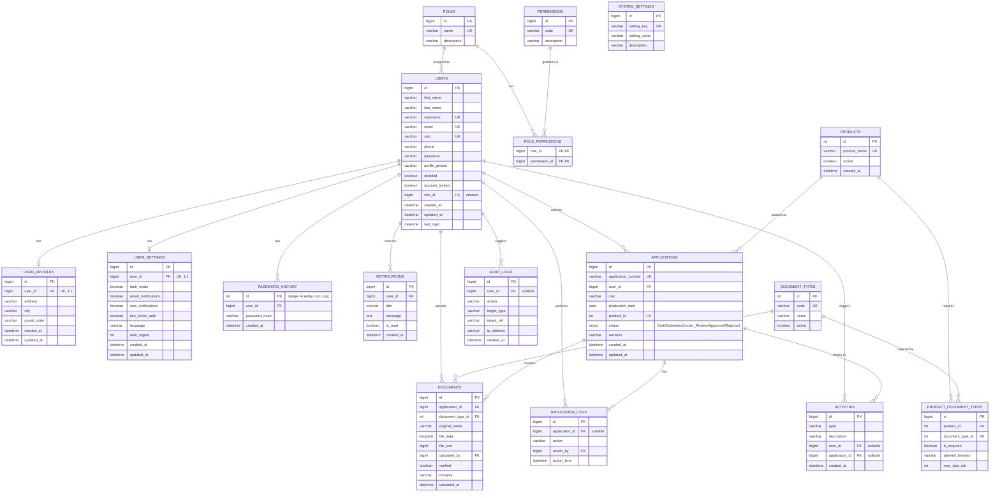

# DPMS Database Rebuild

Reconstructed from `dpms-backend` (JPA entities, repositories, services,
controllers) and cross-checked against `frontend` (forms, services, pages,
routes). Run in this order against a fresh XAMPP/MariaDB instance:

1. `01_schema.sql` — creates `dpms_db` and all tables, keys, constraints.
2. `02_seed.sql` — lookup/reference data only (roles, permissions, products,
   document types, system settings). No fake users/applications.

After running both, start the Spring Boot backend as-is —
`spring.jpa.hibernate.ddl-auto=validate` will succeed because every column
each `@Entity` maps to exists with a compatible name/type.

---

## 1. ER Diagram

---

## 2. Tables backed by real JPA entities (verified 1:1 against source)

| Table | Entity | Notes |
|---|---|---|
| `users` | `User.java` | `username`/`email`/`cnic` each individually `UNIQUE`. `enabled` default true, `account_locked` default false. |
| `user_profiles` | `UserProfile.java` | 1:1 with users via unique `user_id`. `created_at`/`updated_at` are `insertable=false, updatable=false` → DB-side defaults are load-bearing. |
| `user_settings` | `UserSettings.java` | 1:1 with users. All boolean/language/auto_logout defaults match the entity field initializers. |
| `password_history` | `PasswordHistory.java` | PK is `Integer` in the entity (everything else is `Long`) — preserved as-is, see Inconsistencies. |
| `products` | `Product.java` | PK is `Integer`. `active` default true. |
| `applications` | `Application.java` | `status` is a Java enum persisted `EnumType.STRING` → modeled as MySQL `ENUM` with the exact 5 values (`Draft`, `Submitted`, `Under_Review`, `Approved`, `Rejected`), default `Draft`. |
| `application_logs` | `ApplicationLog.java` | `application_id` is nullable — account-level events (login/register/password-change) log with `applicationId = null`. |
| `documents` | `Document.java` | `file_data` is `LONGBLOB`, stored directly in the DB (see Inconsistencies re: `uploads/` folder). |
| `notifications` | `Notification.java` | `title` NOT NULL, `user_id` NOT NULL — the only two truly required columns per the entity. |
| `activities` | `Activity.java` | Table/entity/repository all exist but nothing in the service layer ever inserts into it — see TODO. |

## 3. Inferred / additive objects (no entity today)

These exist only to support the **in-progress Admin module** described in
the task brief. Because `ddl-auto=validate` only checks tables/columns that
a `@Entity` actually maps, none of the following can break backend startup —
Hibernate simply doesn't look at them.

- **`roles`, `permissions`, `role_permissions`, `users.role_id`** — `User.java`
  has no role field at all today; `CustomUserDetailsService` hardcodes every
  authenticated user to `ROLE_USER`, and `SecurityConfig` currently
  `permitAll()`s every request. The frontend, however, already has a role
  concept baked in (`RoleSelection.jsx` lets a user pick "User Dashboard" vs
  "Admin Dashboard", and `ManageUsers.jsx`'s mock data uses the roles
  `Applicant` / `Verifier` / `Admin`). This schema is a minimal RBAC
  scaffold sized to match that mock data so the Admin module has something
  to build against.
- **`document_types`, `product_document_types`** — `Document.documentTypeId`
  (an `Integer`) is read/written everywhere in code with no backing lookup
  table. The frontend hardcodes type IDs 1–6 in `DocumentUpload.jsx` and a
  separate, overlapping per-product requirement matrix in
  `DocumentTypes.jsx` (which also references two document types — "Salary
  Certificate" and "Driving License" — that never appear in the upload
  screen). Both are reconciled into these two tables; see Inconsistencies.
- **`audit_logs`** — backs `frontend/src/pages/admin/AuditLogs.jsx`, which is
  fully hardcoded mock data today. See TODO/Inconsistencies re: overlap with
  `application_logs` and `activities`.
- **`system_settings`** — backs `frontend/src/pages/admin/SystemSettings.jsx`
  (also fully hardcoded mock data), modeled as a generic key/value table so
  new settings can be added without a migration.

## 4. Assumptions made

1. All `String` fields with no explicit `@Column(length=...)` are
   `VARCHAR(255)` (Hibernate's default).
2. All `Boolean` fields are `TINYINT(1)` (MySQL's idiomatic boolean column).
3. All `LocalDateTime` fields are `DATETIME(6)`; `LocalDate` is `DATE`.
4. Entity IDs use `GenerationType.IDENTITY` → `AUTO_INCREMENT`. `Long` →
   `BIGINT UNSIGNED`, `Integer` → `INT UNSIGNED` (`products`, `document_types`,
   and — deliberately preserving the existing inconsistency — `password_history`).
5. FK `ON DELETE` behavior (not specified anywhere in code, since Hibernate
   `validate` mode never manages FKs) was chosen by data ownership:
   - Strictly personal 1:1/owned data (`user_profiles`, `user_settings`,
     `password_history`, `notifications`) → `CASCADE` on user delete.
   - Business records that should survive a user deletion for compliance/audit
     (`applications`) → `RESTRICT`.
   - Pure audit/log rows whose subject may disappear (`application_logs.action_by`,
     `activities.user_id`, `documents.uploaded_by`, `audit_logs.user_id`) →
     `SET NULL`.
   - Child rows that only make sense with their parent application/product
     (`documents`, `product_document_types`) → `CASCADE`.
   Adjust these if your compliance requirements differ.
6. `applications.remarks` and `documents.remarks` were sized `VARCHAR(1000)`
   / `VARCHAR(500)` (no explicit length in the entity) — generous free-text
   remarks fields; increase if needed.
7. Product IDs (1=AGAC, 2=DIG PERSONAL LOAN, 3=ELECTRIC BIKE) and document
   type IDs (1–6 matching `DocumentUpload.jsx`, 7–8 added for
   `DocumentTypes.jsx`'s "Salary Certificate"/"Driving License") are pinned
   with explicit `INSERT ... VALUES (id, ...)` specifically because the
   frontend hardcodes these numbers — do not renumber without also updating
   the frontend.
8. `roles`/`permissions`/`role_permissions` are a reasonable minimum RBAC
   shape inferred from `ManageUsers.jsx`'s mock roles, not derived from any
   real backend authorization code (there isn't any yet).

## 5. TODO — unfinished Admin module work

- [ ] Add a `role` (or `roleId`) field to `User.java` and start actually
  reading/writing `users.role_id` instead of hardcoding `ROLE_USER` in
  `CustomUserDetailsService`.
- [ ] Replace `SecurityConfig`'s `anyRequest().permitAll()` with real
  role/permission-gated authorization once `roles`/`permissions` are wired
  up, and protect `/api/admin/**` for `Admin`/`Verifier` roles only.
- [ ] Wire `AdminServiceImpl.getDashboard()` to populate
  `AdminDashboardDTO.recentActivities` — the field exists on the DTO but is
  never set (always `null`/empty to callers today).
- [ ] Create a `DocumentType` entity/repository backed by the
  `document_types` table above, and have `DocumentServiceImpl` validate
  `documentTypeId` against it (today any integer is accepted and stored
  with no validation or FK enforcement at the application layer).
- [ ] Create a `Product`-aware validation step in `ApplicationServiceImpl`
  so `productId` is checked against `products` before saving (currently
  unvalidated).
- [ ] Wire `ManageUsers.jsx`, `AuditLogs.jsx`, `SystemSettings.jsx`,
  `ApplicationReview.jsx` (admin), and `Reports.jsx` to real backend
  endpoints — all five are 100% hardcoded mock data with no API calls today.
- [ ] Implement real endpoints for `roles`/`permissions` CRUD and a
  `system_settings` get/update endpoint (`GET/PUT /api/admin/settings`) to
  back `SystemSettings.jsx`.
- [ ] Implement a real `/api/admin/audit-logs` endpoint backed by the new
  `audit_logs` table (see Inconsistencies below re: which log table should
  actually be the source of truth).
- [ ] Fix `ApplicationController.create()`'s hardcoded `userId = 19L` (see
  Inconsistencies) once JWT-based authentication is enforced.

## 6. Inconsistencies / bugs found between backend and frontend

1. **`ApplicationLogService` has a dead no-op overload that silently
   swallows every real log call.** `ApplicationLogServiceImpl.saveLog(Object,
   Long, String, Object, Object, String)` (the 6-arg overload) has an
   **empty body**. `UserServiceImpl` calls this exact overload for every
   `LOGIN`, `REGISTER`, `PROFILE_UPDATED`, `PASSWORD_CHANGED`, and
   `USER_DELETED` event — none of them are ever actually persisted to
   `application_logs`, despite the code appearing to log them. Only the
   3-arg `saveLog(Long, Long, String)` overload (never called from
   `UserServiceImpl`) actually inserts a row.
2. **Hardcoded `userId = 19` / `applicationId = 1`.** `ApplicationController
   .create()` passes a literal `19L` as the user id ("temporary user id...
   later JWT se ayega" per the code's own comment) instead of the
   authenticated user. `DocumentUpload.jsx` independently hardcodes
   `applicationId = 1` and `userId = 19` on the frontend too. On a fresh
   database these will reference rows that don't exist — the FK from
   `applications.user_id`/`documents.application_id` will only succeed once
   a user with id 19 happens to exist. This is pre-existing scaffolding, not
   something this schema should paper over with a fake seeded user.
3. **`DocumentServiceImpl.getDocument(Long id)` always returns `null`,**
   while `DocumentController.viewDocument()` calls
   `document.getFileData()` on that (potentially null) result — a latent
   NPE on `GET /api/documents/{id}/view` that a fresh DB won't fix.
4. **Three overlapping "activity log" concepts** exist simultaneously:
   `application_logs` (per-application actions), `activities` (a generic
   feed, entity/table present but completely unused by any service), and
   the newly inferred `audit_logs` (backing the Admin "Audit Logs" mock
   page). Recommend consolidating to one before building the real Admin
   audit feature — right now none of the three is a complete source of
   truth.
5. **`file_data` is stored as a `LONGBLOB` directly in MySQL**, yet
   `dpms-backend/uploads/documents/` exists on disk as if file storage were
   originally meant to be filesystem-based. Confirm which storage strategy
   is intended going forward; storing large binaries in MySQL works but
   doesn't scale as well as disk/object storage + a path reference.
6. **Max upload size mismatch.** `application.properties` sets
   `spring.servlet.multipart.max-file-size=10MB` /
   `max-request-size=20MB`, while `SystemSettings.jsx`'s (mock, unwired)
   default is `maxFileSize: "20"` and `DocumentUpload.jsx`'s client-side
   check caps each file at 5MB. None of these three numbers currently agree
   and none but the Spring property are actually enforced anywhere.
7. **Two independent, non-communicating JWT implementations** —
   `security/JwtService.java` (reads secret/expiration from
   `application.properties`, used by `UserServiceImpl`) and
   `security/JwtUtil.java` (a separate hardcoded-secret implementation,
   currently unused by any controller/service — dead code, or a leftover
   from an earlier iteration).
8. **`AuthController`'s `@CrossOrigin` is pinned to
   `http://localhost:5173`** while `AdminController`/`DocumentController`
   use a bare `@CrossOrigin` (any origin) — inconsistent CORS policy across
   controllers, worth unifying (see `config/CorsConfig.java`).
9. **`PasswordHistoryRepository`, `ApplicationLogRepository`,
   `ActivityRepository`** are otherwise-unused beyond basic CRUD/inserts —
   fine for now, called out only because Phase 5 asked to flag anything
   that looked like dead surface area.

## 7. Verification performed

- Every `@Column(name=...)` / implicit camelCase→snake_case column name in
  every entity in `dpms-backend/src/main/java/.../entity/` was matched
  against a column in `01_schema.sql`.
- Every repository method (`findBy...`, `countBy...`, `existsBy...`) was
  checked — none reference a field that isn't already a mapped entity
  column (no missing-column risk from derived query methods).
- Every DTO (`RegisterRequest`, `ApplicationRequest`, `ChangePasswordRequest`,
  `ProfileDto`, `LoginResponse`, `UserResponse`, `DashboardResponse`,
  `AdminDashboardDTO`, `AdminRecentApplicationDTO`, `AdminActivityDTO`) was
  cross-checked against the tables/columns it reads from or writes to.
- Every frontend service (`authService`, `userService`, `profileService`,
  `dashboardService`, `notificationService`, `userSettingService`) and every
  page under `frontend/src/pages/**` was read to confirm request/response
  field names line up with the schema above and to find any field the
  backend doesn't yet expose.
